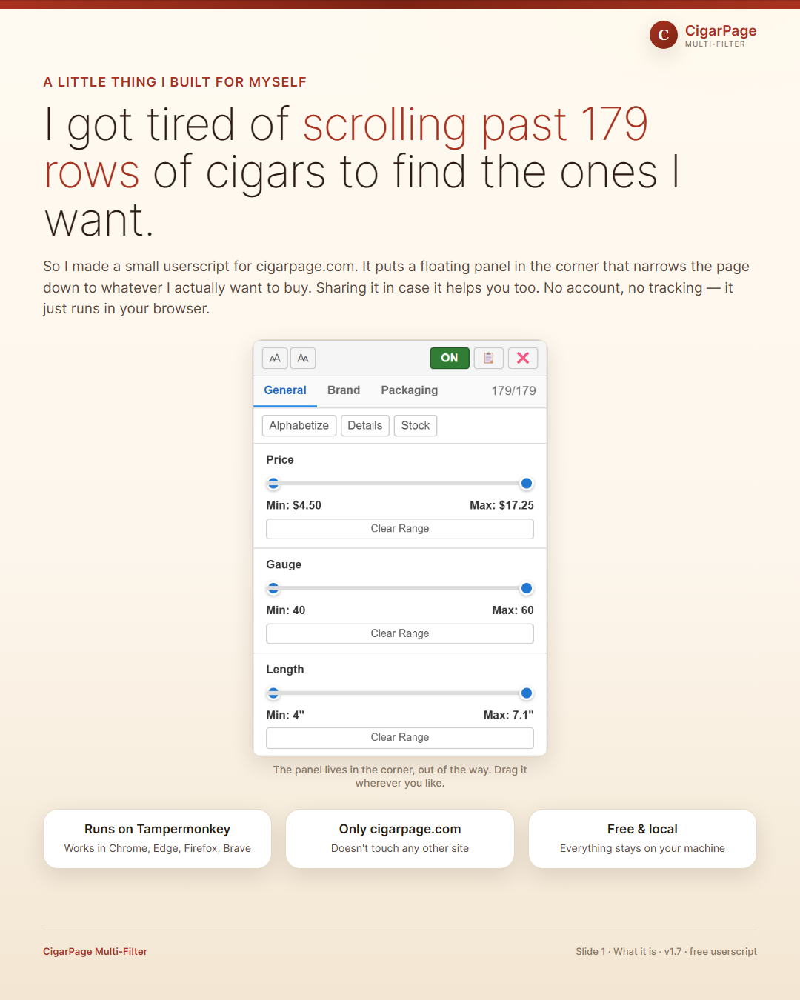
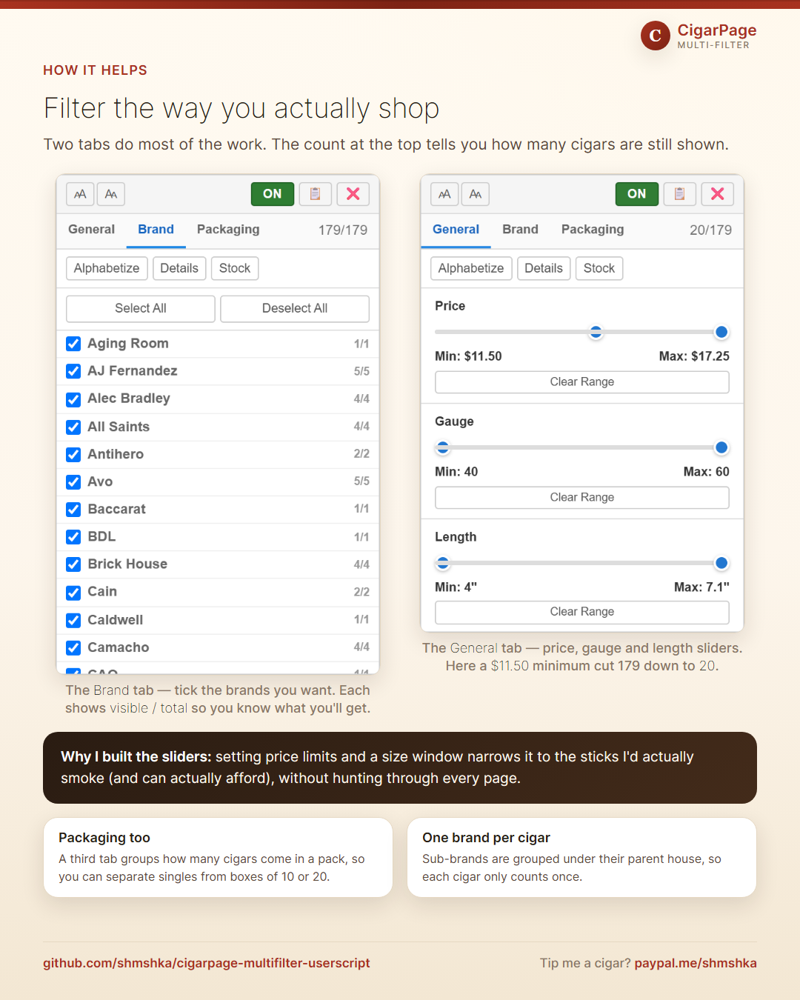
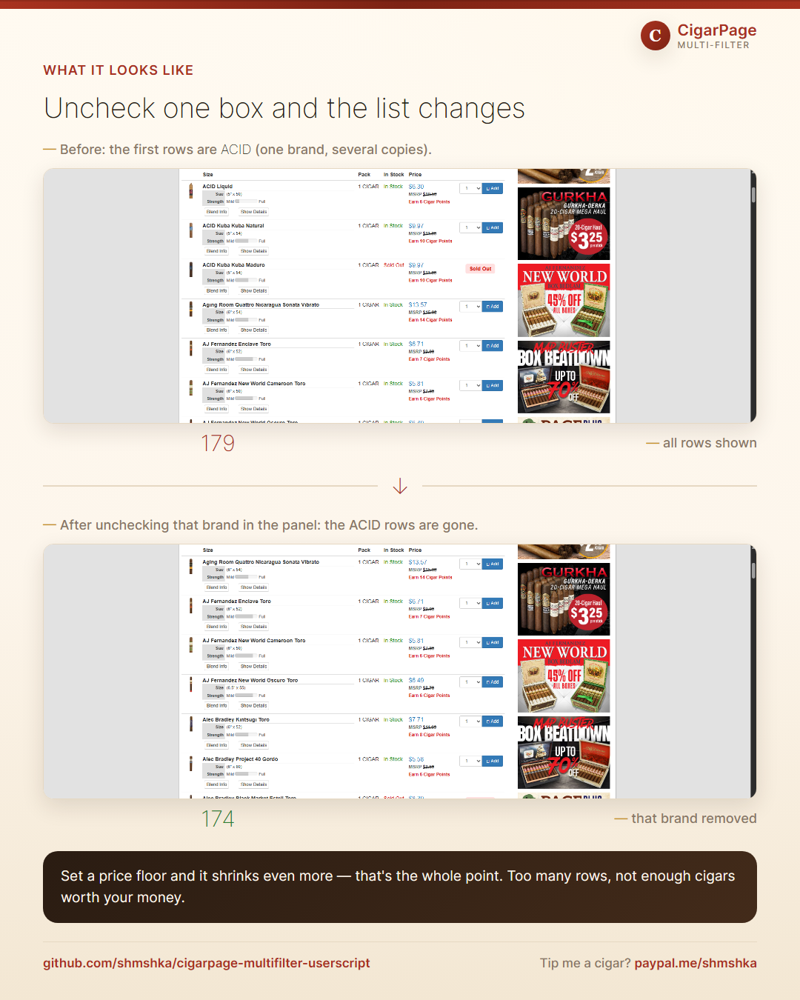
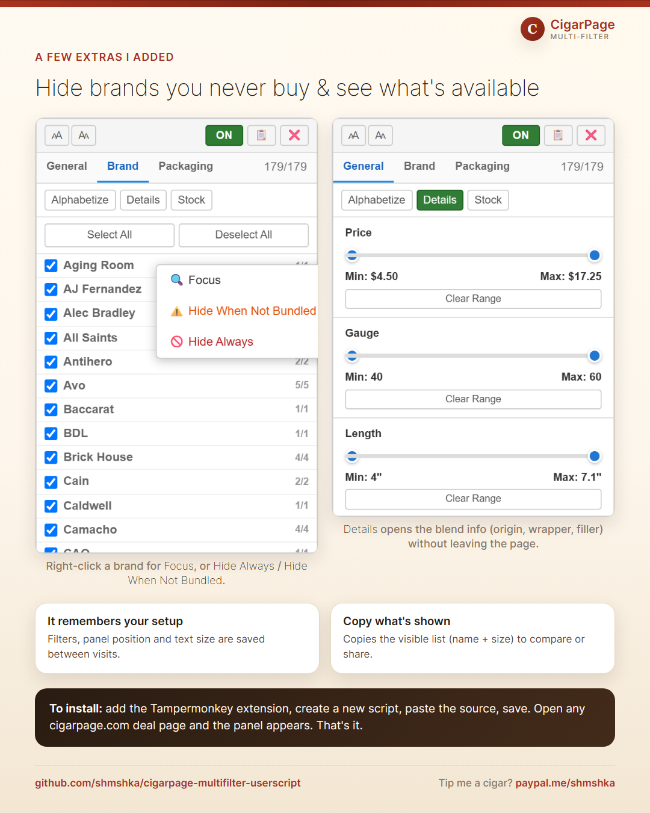

# CigarPage Multi-Filter

A userscript that adds a floating filter panel to [cigarpage.com](https://www.cigarpage.com).

## Features

- Filter products by **price**, **gauge**, **length**, **brand**, and **packaging**
- Toggle to **hide sold-out** items
- **Alphabetize** products by brand, then title
- **One-click expand** of product details
- Sub-brands fold into their parent houses (e.g. ACID, Deadwood → Drew Estate)
- Right-click a brand to **focus** (preview) or **purge** it permanently
- Settings persist between visits

## Install

1. Install [Violentmonkey](https://violentmonkey.github.io/), [Tampermonkey](https://www.tampermonkey.net/), or other userscript manager of your preference.
2. Open the [raw userscript](https://github.com/shmshka/cigarpage-multifilter-userscript/raw/main/cigarpage-filter.user.js) and click **Install**.

## Usage

A floating panel now appears in the
bottom-right corner of any cigarpage.com listing. Drag it, resize the panel
font, and toggle filters to taste.

## Walkthrough Infographics

Click to Expand...

    
1. **Introduction** — the floating panel appears in the corner.

   

2. **Filtering** — the **Brand** and **General** tabs narrow the list to what you want.

   

3. **Before & after** — uncheck a brand and the list updates instantly.

   

4. **Extras** — right-click a brand to focus or hide it, and expand details in place.

   

   
## Buy Me A ~~Coffee~~ <bold>Cigar</bold> *(if you feel like it)*
  
*[paypal.me/shmshka](https://www.paypal.me/shmshka)*
